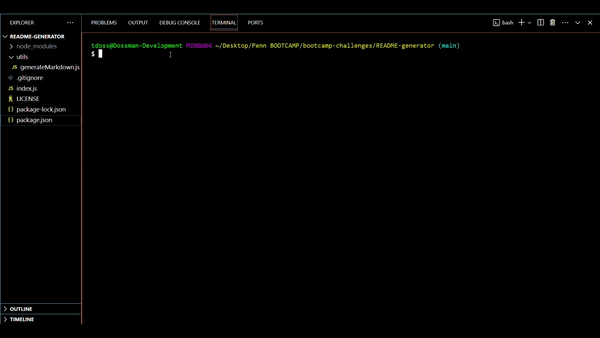
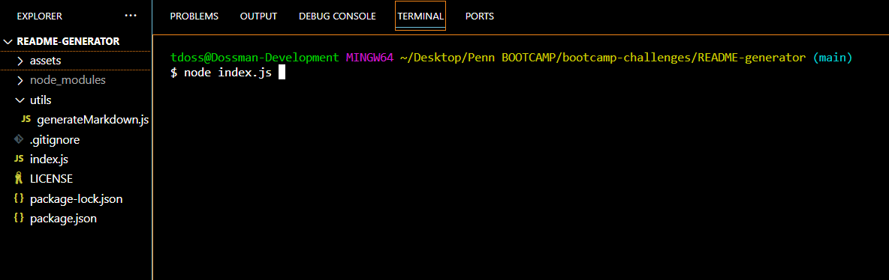
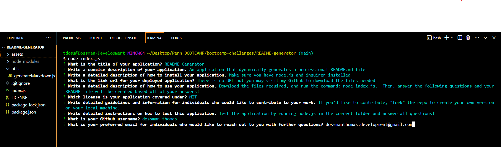
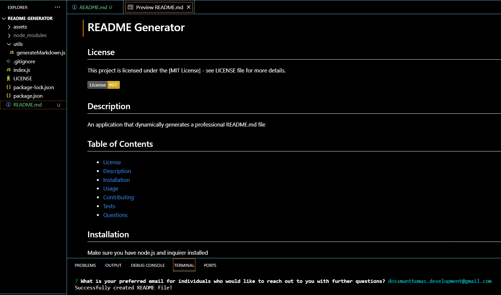

# README.md Generator

## License

This project is licensed under the [MIT License] - see [LICENSE](LICENSE) file for more details.

[](https://opensource.org/licenses/MIT)

## Description

A command-line application that dynamically generates a professional README.md file based on user responses to a series of questions regarding the file.  

## Table of Contents

- [License](#license)
- [Description](#description)
- [Demonstration](#demonstration)
- [Screenshots](#screenshots)
- [Installation](#installation)
- [Usage](#usage)
- [Contributing](#contributing)
- [Questions](#questions)

## Demonstration



## Screenshots







## Installation

Download project files from repository and make sure you have Node.js, NPM, and inquirer installed on your local machine.

## Usage
### Prerequisites:
- Download files from repository to run on local machine.
- Download and install Node.js.
- Install inquirer and any other dependencies. 

### Run application:
- Open the command terminal
- Navigate to the appropriate file
- Run Node JS using the following command: 
```GitBash
node index.js
```
- Answer the following questions to the best of your ability
- Review and revise dynamically generated README.md file

## Contributing

Thank you for considering contributing to this project! I gladly welcome all contributions.

### How to Contribute:

**Fork the Repository**: Click on the "Fork" button on the top right corner of this repository's page. This will create a copy of the repository on your local machine.

## Questions

[Find me on Github!](github.com/dossman-thomas)

If you have any further questions, feel free to reach me via tdossman.development@gmail.com

